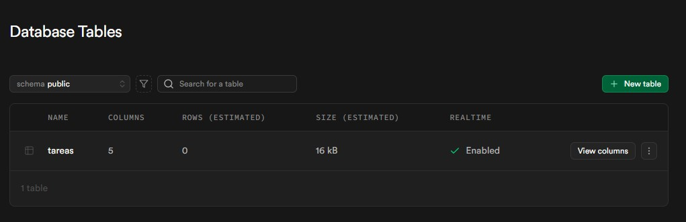
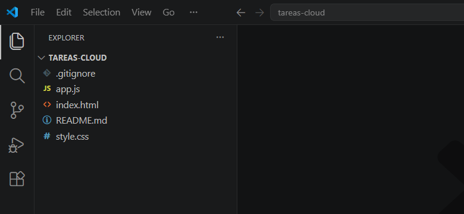
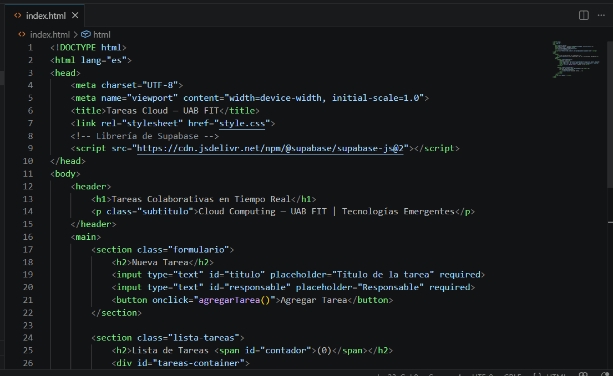
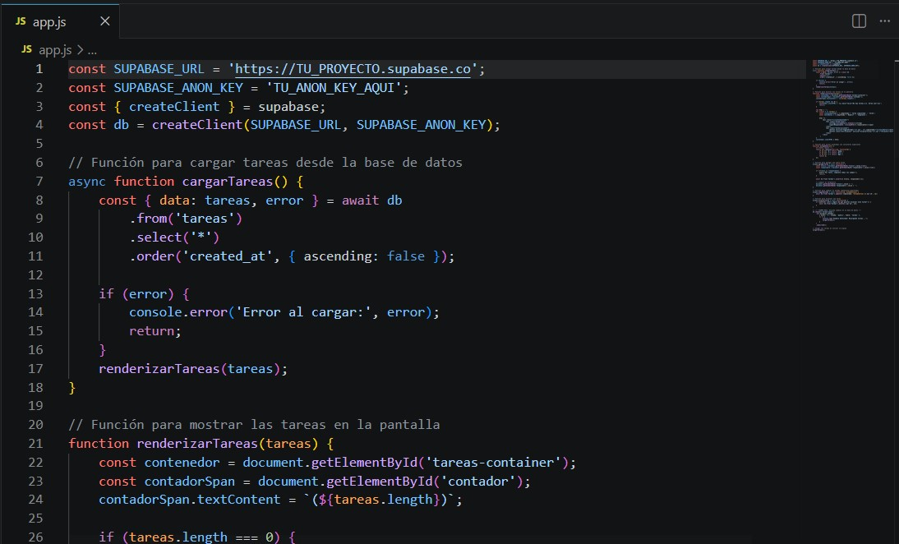
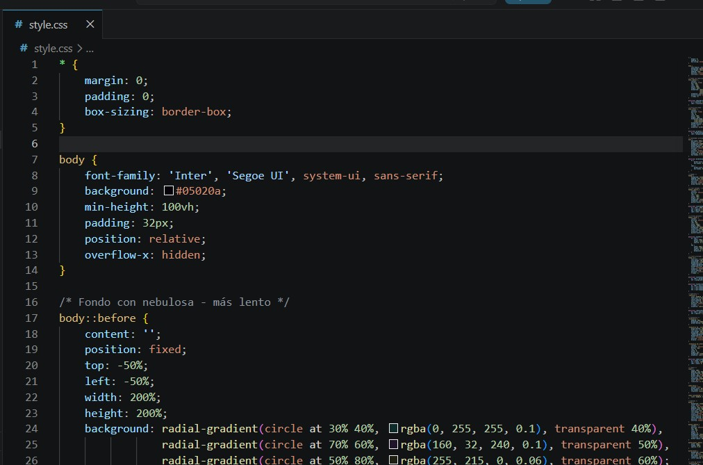
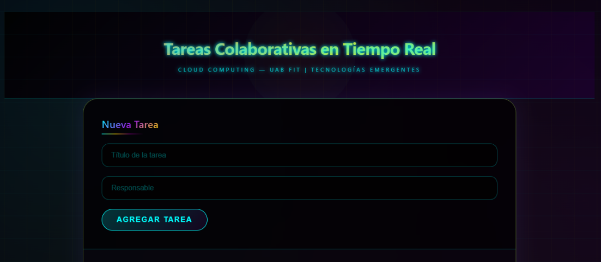
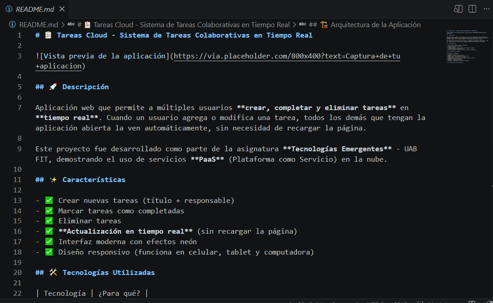
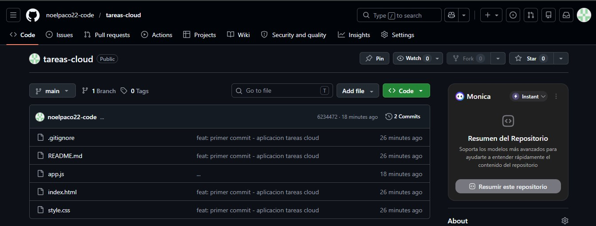
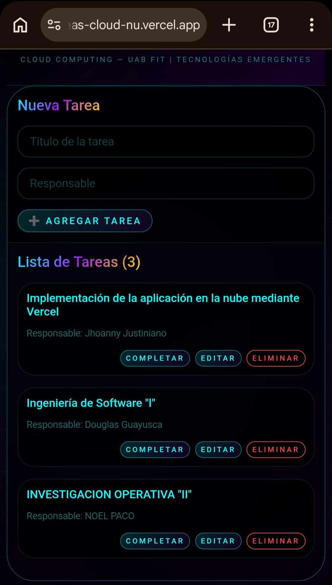

# 📋 Tareas Cloud - Sistema de Tareas Colaborativas en Tiempo Real


---

## 📝 Descripción

**Tareas Cloud** es una aplicación web colaborativa que permite a múltiples usuarios gestionar tareas en **tiempo real**. Cuando un usuario agrega, edita o elimina una tarea, todos los demás usuarios conectados ven los cambios automáticamente, sin necesidad de recargar la página.

Esta aplicación fue desarrollada como parte de la asignatura **Tecnologías Emergentes** (7mo Semestre) de la carrera de **Ingeniería de Sistemas** en la **UAB FIT**, con el objetivo de demostrar el uso de servicios **PaaS** (Plataforma como Servicio) en el desarrollo de software moderno.

---

## 🎯 Objetivos

### Objetivo General
Desarrollar una aplicación web funcional que integre un backend en tiempo real utilizando Supabase como servicio PaaS, gestionar el código fuente con Git y GitHub, y realizar su despliegue en producción mediante Vercel; aplicando los conceptos de Cloud Computing vistos en clase.

### Objetivos Específicos
1. Comprender el rol de PaaS en el ciclo de vida del desarrollo de software.
2. Crear y configurar un proyecto en Supabase como backend gestionado en la nube.
3. Implementar operaciones CRUD y tiempo real con Supabase Realtime.
4. Aplicar control de versiones con Git y colaboración en GitHub.
5. Desplegar y poner en producción la aplicación usando Vercel.
6. Reflexionar sobre las ventajas del modelo PaaS respecto al despliegue tradicional.

---

## ✨ Características

- ✅ Crear nuevas tareas (título + responsable)
- ✅ Marcar tareas como completadas
- ✅ Editar tareas existentes
- ✅ Eliminar tareas
- ✅ **Actualización en tiempo real** (sin recargar la página)
- ✅ Interfaz moderna con efectos neón
- ✅ Diseño responsivo (celular, tablet y computadora)
- ✅ Notificaciones visuales
- ✅ Modales personalizados para editar y eliminar

---

## 🛠️ Tecnologías Utilizadas

| Tecnología | Función | Enlace |
|------------|---------|--------|
| **Visual Studio Code** | Editor de código fuente | [code.visualstudio.com](https://code.visualstudio.com) |
| **HTML5 + CSS3 + JavaScript** | Desarrollo frontend | - |
| **Supabase** | Backend en la nube (Base de datos + Auth + Realtime) | [supabase.com](https://supabase.com) |
| **Git** | Control de versiones | [git-scm.com](https://git-scm.com) |
| **GitHub** | Repositorio remoto y colaboración | [github.com](https://github.com) |
| **Vercel** | Despliegue y hosting en la nube | [vercel.com](https://vercel.com) |

---

## 🏗️ Arquitectura de la Aplicación

### Diagrama de Arquitectura Cloud

**Frontend (Vercel)**
- HTML5, CSS3, JavaScript
- Diseño responsivo (PC, Tablet, Celular)
- URL: https://tareas-cloud-nu.vercel.app/

**Backend (Supabase)**
- Base de datos PostgreSQL
- Tabla: tareas (id, titulo, responsable, completada, created_at)
- Tiempo Real (WebSockets) con eventos: INSERT, UPDATE, DELETE
- Seguridad: RLS con políticas de acceso público

**Flujo de la aplicación:**
1. Usuario accede a la URL
2. Frontend carga la interfaz
3. JavaScript se conecta a Supabase
4. Supabase devuelve las tareas
5. Los cambios se sincronizan en tiempo real
6. Todos los usuarios ven los cambios al instante
## 📦 Instalación Local
### Requisitos Previos
- [Visual Studio Code](https://code.visualstudio.com/)
- [Git](https://git-scm.com/)
- Cuenta gratuita en [Supabase](https://supabase.com)
- Cuenta gratuita en [GitHub](https://github.com)

### Pasos para ejecutar localmente

1. **Descargar el proyecto**
   - Desde GitHub, haz clic en "Code" y luego en "Download ZIP"
   - O clona el repositorio con: `git clone https://github.com/noelpaco22-code/tareas-cloud.git`

2. **Configurar Supabase**
   - Crear un proyecto en Supabase
   - Ejecutar el siguiente SQL en el editor SQL:
   ```sql
   CREATE TABLE tareas (
       id UUID DEFAULT gen_random_uuid() PRIMARY KEY,
       titulo TEXT NOT NULL,
       responsable TEXT NOT NULL,
       completada BOOLEAN DEFAULT FALSE,
       created_at TIMESTAMP DEFAULT NOW()
   );

   ALTER TABLE tareas ENABLE ROW LEVEL SECURITY;
   CREATE POLICY "acceso_publico" ON tareas FOR ALL USING (true);
   ALTER PUBLICATION supabase_realtime ADD TABLE tareas;

3. **Conectar la aplicación**
   - Abrir `app.js`
   - Reemplazar las credenciales:
   ```javascript
   const SUPABASE_URL = 'https://tu-proyecto.supabase.co';
   const SUPABASE_ANON_KEY = 'tu-anon-key-aqui';

4. Ejecutar la aplicación
Abrir index.html en tu navegador
¡Listo!

## 📸 Capturas de Pantalla

### FASE 1: Configuración de Supabase

*Proyecto creado en Supabase*


*Tabla tareas creada con SQL Editor*


*Script SQL ejecutado correctamente*

### FASE 2: Estructura del Proyecto

*Estructura de archivos del proyecto*

### FASE 3: Desarrollo de la Aplicación

*Estructura HTML de la aplicación*


*Lógica de conexión con Supabase*


*Funciones CRUD y tiempo real*


*Estilos modernos con efectos neón*


*Documentación del proyecto*

### FASE 4: Control de Versiones (GitHub)

*Repositorio tareas-cloud en GitHub*

### FASE 5: Despliegue en Vercel

*Aplicación desplegada en producción*

---

## 👥 Autores

| Nombre | Rol |
|--------|-----|
| **Noel Paco Toledo** | Desarrollador |
| **Jhoanny Justiniano Mendoza** | Desarrollador |
| **Douglas Guayusca Flores** | Desarrollador |

**Docente:** ING. Hermes Rodriguez Rivero  
**Asignatura:** Tecnologías Emergentes (7mo Semestre)  
**Universidad:** UAB FIT - Facultad de Ingeniería y Tecnología  
**Carrera:** Ingeniería en Sistemas  
**Fecha:** Junio 2026

---

## 📚 Reflexión Final

La práctica permitió implementar una aplicación colaborativa en tiempo real utilizando servicios cloud modernos. Se integraron:

- **GitHub** para el control de versiones y colaboración
- **Supabase** como plataforma backend (PaaS) con base de datos y tiempo real
- **Vercel** para el despliegue automático y hosting

Se logró una solución **accesible, escalable y disponible** desde cualquier dispositivo con acceso a Internet, demostrando las ventajas del modelo PaaS en el desarrollo de software moderno.

---

## 📋 Preguntas Guía

### 1. ¿En qué modelo de servicio (IaaS/PaaS/SaaS) clasificarías a Supabase y por qué?

**Supabase se clasifica como PaaS (Platform as a Service)** porque proporciona una plataforma completa para desarrollar aplicaciones sin necesidad de administrar servidores. Ofrece base de datos PostgreSQL, autenticación, almacenamiento y tiempo real como servicios integrados y gestionados.

### 2. ¿Qué tareas del backend manejó Supabase que normalmente tendrías que hacer manualmente?

Supabase administró:
- ✅ La base de datos PostgreSQL
- ✅ Almacenamiento y consulta de datos
- ✅ Sincronización en tiempo real (WebSockets)
- ✅ Políticas de seguridad (Row Level Security)
- ✅ API automática para operaciones CRUD

### 3. ¿Cómo funciona el tiempo real en Supabase? ¿Qué tecnología subyacente utiliza?

Supabase utiliza **WebSockets** a través de la extensión `pg_realtime` de PostgreSQL. Cuando ocurre un cambio en la base de datos (INSERT, UPDATE, DELETE), se emiten eventos a todos los clientes conectados, permitiendo que la interfaz se actualice automáticamente sin recargar la página.

### 4. ¿Cuál fue el proceso de CI/CD que implementaste con GitHub y Vercel?

El proceso fue:
1. Desarrollo local del proyecto
2. Commits periódicos a GitHub con mensajes descriptivos
3. Vercel detecta automáticamente los cambios en el repositorio
4. Vercel construye y despliega la nueva versión automáticamente

### 5. ¿Qué ventajas y desventajas encontraste en el modelo PaaS comparado con un servidor tradicional?

| Ventajas | Desventajas |
|----------|-------------|
| Rapidez de desarrollo | Dependencia del proveedor |
| Menor administración de infraestructura | Costos al crecer la aplicación |
| Escalabilidad automática | Menor control sobre la infraestructura |
| No hay que configurar servidores | Posibles limitaciones en personalización |

### 6. ¿Qué consideraciones de seguridad deberías aplicar si esta fuera una aplicación en producción real?

- 🔒 Variables de entorno para claves API (no hardcodearlas)
- 🔒 Políticas RLS (Row Level Security) en Supabase
- 🔒 HTTPS obligatorio
- 🔒 Autenticación de usuarios (login/registro)
- 🔒 Control de permisos y roles
- 🔒 Validación de datos en frontend y backend
- 🔒 Límites de tasa (rate limiting)
- 🔒 Auditoría de accesos y logs

---

## 📝 Licencia

Este proyecto es de uso académico para la materia **Tecnologías Emergentes** - UAB FIT.

---

**Desarrollado con ❤️ por el equipo de Tecnologías Emergentes**

*Santísima Trinidad - Bolivia, Junio 2026*
